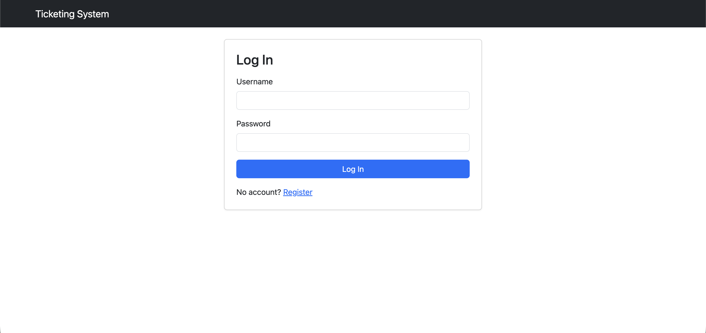
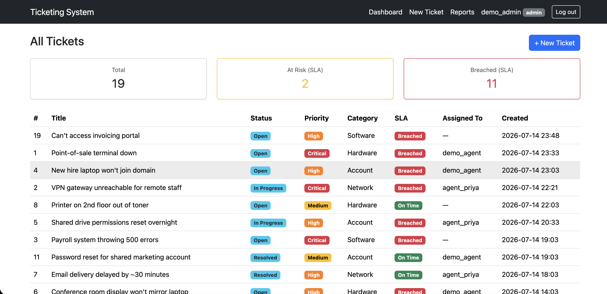
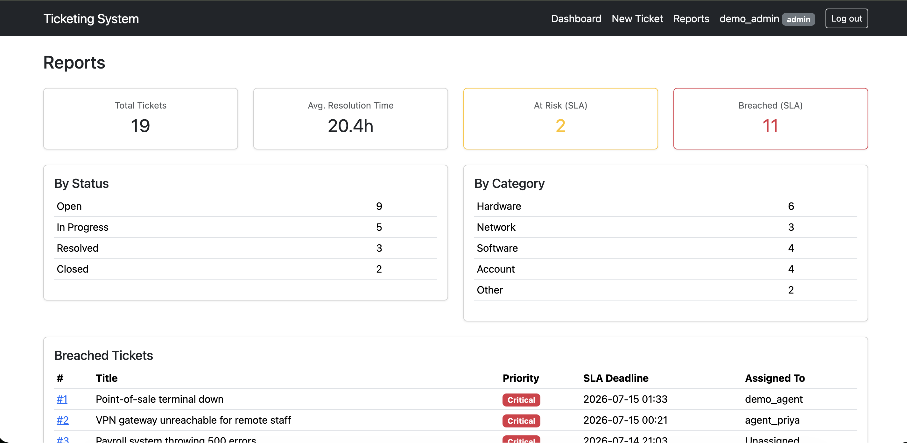
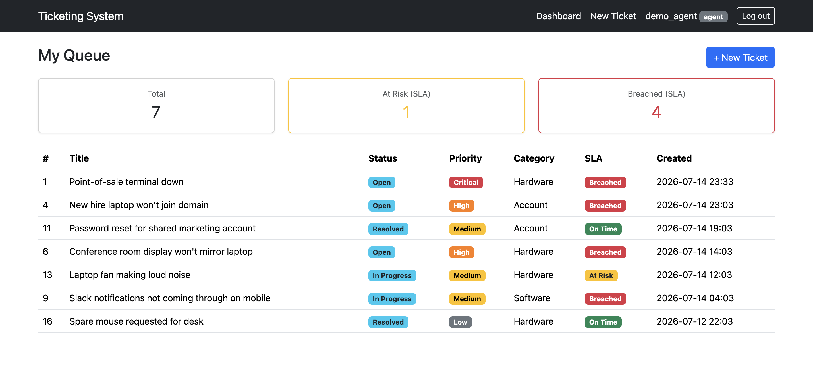
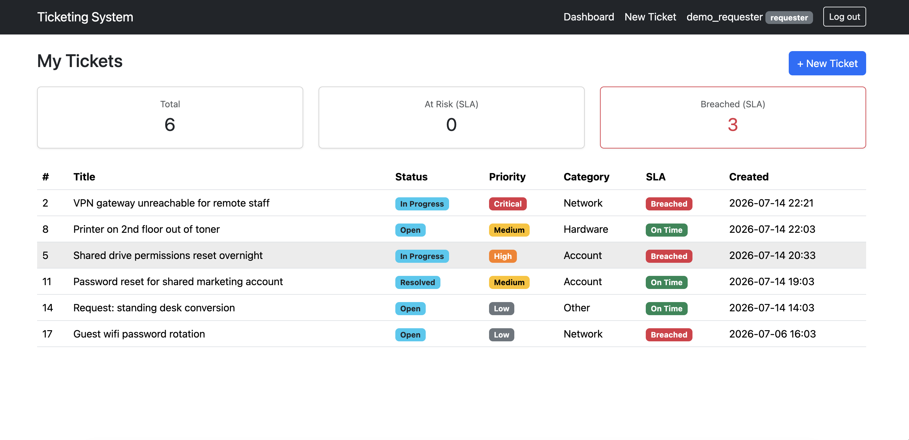
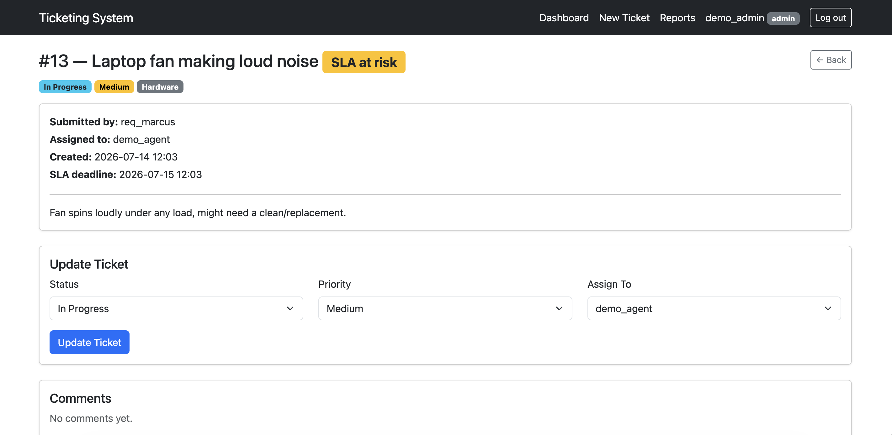
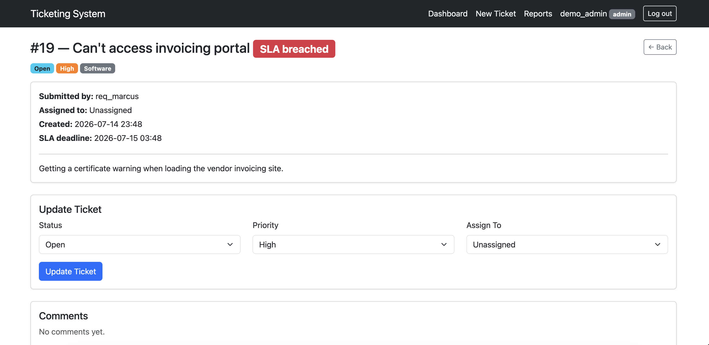

# IT Ticketing System

A self-hosted IT help-desk app with real SLA tracking and role-based access — built for small teams that need to triage requests, keep agents accountable to response-time targets, and give requesters a place to check on their own tickets.

**[Live demo →](https://it-ticketing-system-dgfv.onrender.com)**

Demo logins (all use the same password `demopass123`):

| Role | Username | What they see |
|---|---|---|
| Admin | `demo_admin` | Every ticket, can reassign agents, sees the SLA reports page |
| Agent | `demo_agent` | Only tickets assigned to them |
| Requester | `demo_requester` | Only tickets they personally submitted |

## Screenshots

**Login**


**Admin dashboard** — sees every ticket, including unassigned intake, and can reassign between agents


**Admin reports** — SLA breach/at-risk breakdown, admin-only


**Agent queue** — agents only see tickets assigned to them


**Requester view** — requesters only see tickets they personally submitted


**SLA: At Risk** — a ticket approaching its deadline


**SLA: Breached** — a ticket past its deadline


## Features

- **SLA tracking that's actually enforced.** Every ticket gets a deadline the moment it's created, based on priority (Critical: 2h, High: 4h, Medium: 24h, Low: 72h). Each ticket carries a live status — **On Time**, **At Risk** (past 75% of its SLA window), or **Breached** — shown as a badge on the dashboard, the ticket page, and rolled up on the admin reports page.
- **Role-based access control**, enforced server-side, not just hidden in the UI:
  - *Requesters* can only see and comment on tickets they filed.
  - *Agents* only see tickets assigned to them, and can update status/priority but can't reassign.
  - *Admins* see the full queue (including unassigned intake), can reassign tickets between agents, and get an SLA breach/at-risk report.
- **Ticket lifecycle**: open → in progress → resolved/closed, with a resolution-time calculation and a comment thread per ticket for history.
- **Audit log**, recorded server-side on every creation/update/comment and surfaced as a "Recent Activity" feed on the admin reports page — not just written to the database and never looked at again.
- **Rate-limited login** (10 attempts/minute per IP via Flask-Limiter). Uses a true moving window rather than the library's default fixed-clock-aligned window - a fixed window resets exactly at each new minute, so a burst right at that boundary (e.g. 9 attempts at :59, 9 more at :00) can let through nearly twice the intended limit in a couple of seconds. A moving window closes that gap.
- Password hashing via bcrypt, CSRF protection on all forms (Flask-WTF), session auth via Flask-Login.

## Tech stack

- **Backend:** Flask, Flask-SQLAlchemy, Flask-Login, Flask-WTF, Flask-Bcrypt, Flask-Limiter
- **Database:** SQLite for local dev; works against Postgres in production via `DATABASE_URL` (no schema changes needed — roles/statuses/priorities are plain strings, not DB-native enums)
- **Frontend:** Server-rendered Jinja2 templates + Bootstrap 5 (no separate JS build step)
- **Testing:** pytest, with an in-memory SQLite DB per test run

## Run locally

```bash
git clone https://github.com/Mustafachad/it-ticketing-system.git
cd it-ticketing-system
python -m venv venv
source venv/bin/activate        # venv\Scripts\activate on Windows

pip install -r requirements.txt
python seed.py                  # wipes & populates demo data (users + ~19 tickets)
python run.py                   # http://localhost:5000
```

> On macOS, port 5000 sometimes conflicts with AirPlay Receiver. If `localhost:5000` doesn't load, run `PORT=5001 python run.py` instead.

Log in with any of the demo accounts above, or register a new account (self-registration always creates a `requester`).

### Running the tests

```bash
pip install -r requirements-dev.txt
pytest
```

Tests cover ticket creation, SLA deadline/status math (on-time/at-risk/breached, including tickets resolved before vs. after their deadline), access control (including an explicit test that an agent's tampered request can't reassign a ticket to themselves or another agent), the audit log actually recording and surfacing an entry after ticket creation, and that repeated login attempts get rate-limited.

## Project structure

```
app/
  auth/          # registration, login, logout
  tickets/       # dashboard, ticket detail, create, reports
  models.py      # User, Ticket, Comment, AuditLog + the SLA logic
  templates/
  static/
tests/
seed.py          # demo data
run.py
```

## Deploying (Render)

The app is ready to deploy as-is:

1. Push this repo to GitHub (already done if you're reading this there).
2. On [Render](https://render.com), create a **New Web Service** from the repo.
   - Build command: `pip install -r requirements.txt`
   - Start command: `gunicorn run:app --bind 0.0.0.0:$PORT` (already declared in `Procfile`, so Render should pick it up automatically)
3. Add a **Postgres** instance (Render's free Postgres works fine) and set the web service's `DATABASE_URL` environment variable to its connection string. `postgres://` URLs are handled automatically (rewritten to `postgresql://` for SQLAlchemy).
4. Set a real `SECRET_KEY` environment variable (anything long and random - don't reuse the dev default).
5. Once deployed, open a shell on the service (or run it as a one-off job) and run `python seed.py` to populate the same demo accounts/tickets described above.

## Known limitations

- **Rate limiting uses in-memory storage.** Fine for this deployment (a single gunicorn worker), but if this were ever scaled to multiple workers/instances, each would track attempts independently - a shared backend like Redis would be needed for the limit to actually hold across all of them.
- **No password complexity rules** beyond a 6-character minimum. Not a concern for this project (no real sensitive data behind it), but worth calling out rather than leaving implicit.

## License

MIT — see [LICENSE](LICENSE).